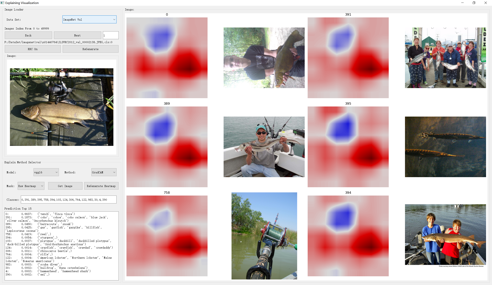
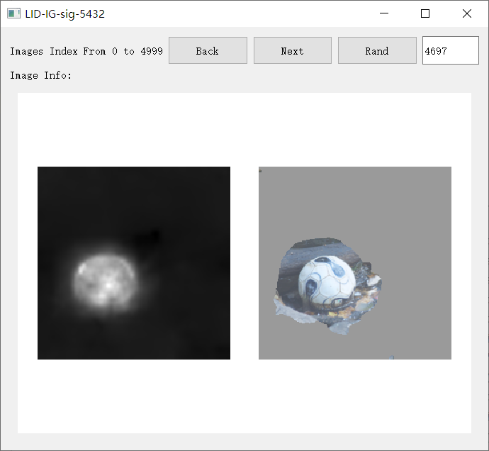
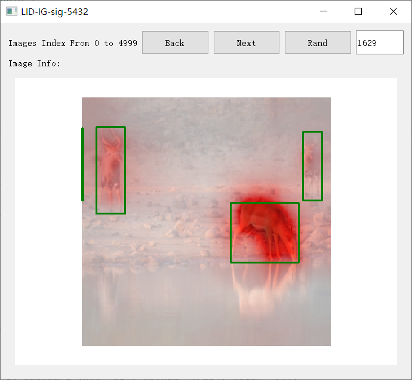
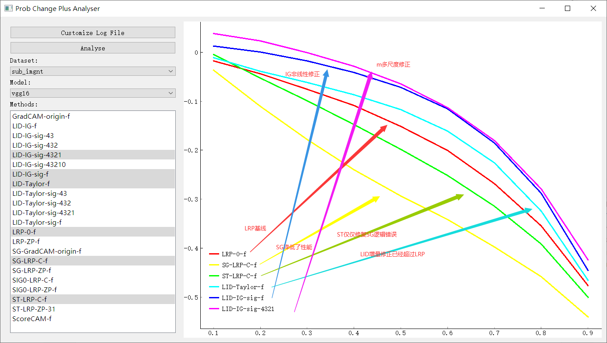

# Heatmap Explanation-Visualization&Evaluation
CNN Explanation Visualization and Evaluation

## Content
Heatmap Visualization

Heatmap Evaluation

## Usage

### Visualization:

1. store customized Heatmap Generator Script in '/methods/'

       # Heatmap Generator must be called by 'x, y' , return heatmap

2. import & add prompts in '[HeatmapMethods.py](HeatmapMethods.py)-heatmap_methods'

        # the method prompt interface, all methods must follow this:
        # the method prompt can be called twice
        # 1. the method first accept "model" parameter, create a callable function "_m = m(model)"
        # 2. the heatmap generated by secondly calling "hm = _m(x,yc)"
        # easily coding by lambda model: lambda x,y: function

3. start '[ExpVis.py](ExpVis.py)' ,a Screen will show. use gui to choose dataset, model, heatmap method. 

**Notice: LRP series only For Vgg16**

### Evaluation 

1. set all evaluation settings & add prompts in '[EvalSettings.py](EvalSettings.py)-eval_heatmap_methods'

2. store customized Heatmap Evaluator in '/Evaluators/', we provide 'Prob Change','Maximal Patch', 'Point Game' Evaluators.

       # Evaluator must be accept dataset, model, heatmap_method
       # Evaluator will get scores in every sample evaluating.
       # Evaluator must generate output string to save.

3. run '[ExpEval.py](ExpEval.py)', Evaluation Results are stored in '/datas/'.

4. you can find some compatible Analysers in '/EvalAnalysers/', code yourself analyser

if you set vision check = True, you will see...

Prob Change Plus:

Maximal Patch:

Point Game:

if you run analysis...

Prob Change Plus:

